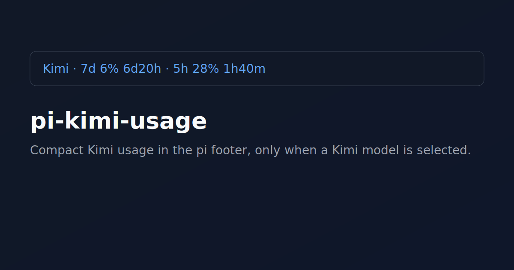

# pi-kimi-usage

[](https://shittycodingagent.ai/packages)
[](./LICENSE)

A pi extension that shows compact Kimi usage info in the footer, only when a `kimi-coding` model is selected.

Example output:

```text
Kimi · 7d 6% 6d20h · 5h 28% 1h40m
```



## Features

- Shows Kimi usage only for `kimi-coding` models
- Refreshes on session start, every 60 seconds, and on turn end
- Reads auth from:
  1. `KIMI_API_KEY`
  2. `~/.pi/agent/auth.json` → `kimi-coding.key`
     - literal key
     - env var name
     - shell command prefixed with `!`
- Uses `KIMI_CODE_BASE_URL` if set, otherwise defaults to `https://api.kimi.com/coding/v1/usages`

## Install

```bash
pi install git:github.com/muffe/pi-kimi-usage
```

## Notes

This extension intentionally resolves `auth.json` shell-command keys (values starting with `!`) to match pi auth behavior.
